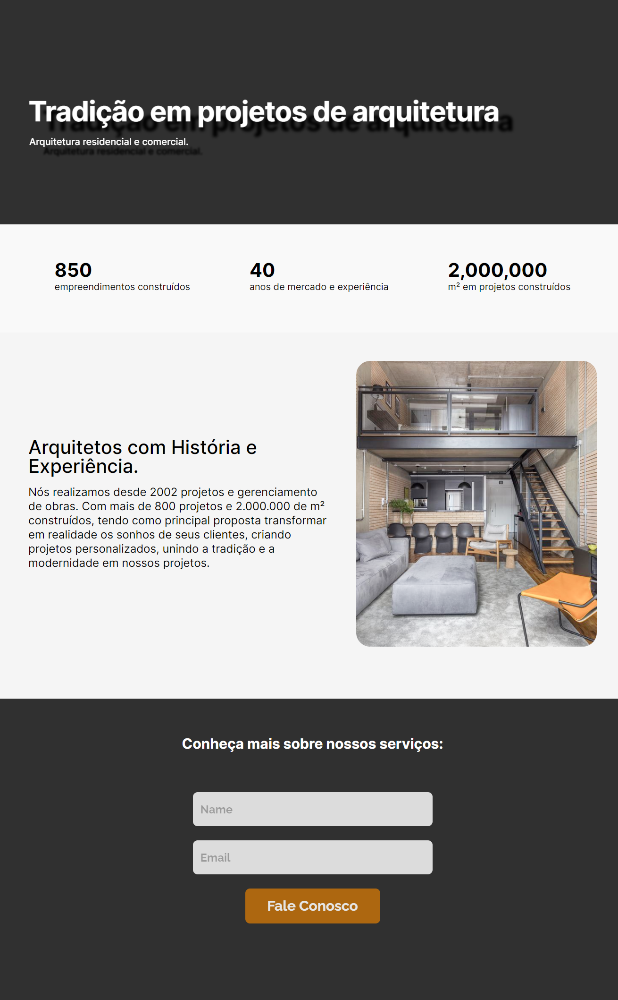

# Landing Page DNC School

## Escola DNC Ciclo Base
## Recriando Layout Desafio 01

> Formação em Tecnologia

Projeto construido atraves do primeiro desafio do ciclo base.

> [🔗 Clique aqui para acessar]()

> [🔗 Clique aqui para acessar a Planilha  do Sheet Monkey 🐒](https://docs.google.com/spreadsheets/d/1rDhTuJtyDEnVnAE0c6gX3m-SrFCtKZVngprJze3hcEA/edit#gid=0)

# 🧰🛠️ Tecnologias

- HTML
- CSS
- Git e Github
- Grid
- Variavéis
- Mobile-First
- Acessibilidade
- WEB
- FIGMA
- FlexBox
- Fontes e personalizção
- Trasição e tranformação
- Formularios
- MonkShets
- Clamp
- Medida Flexível
- Linear-gradient
- Function
- JavaScript

# 💛 Contato

sebastiaovitor18@gmail.com

[Linkedin](https://www.linkedin.com/in/sebastião-vitor-7a2870106/)
=======

Projeto feito através do figma que nos foi apresentado pela DNC, no projeto foram testadas nossas habilidades e capacidade de desenvolvimento de projetos FreeLance.

Ansioso para as próximas etapas.
😁bora codar.